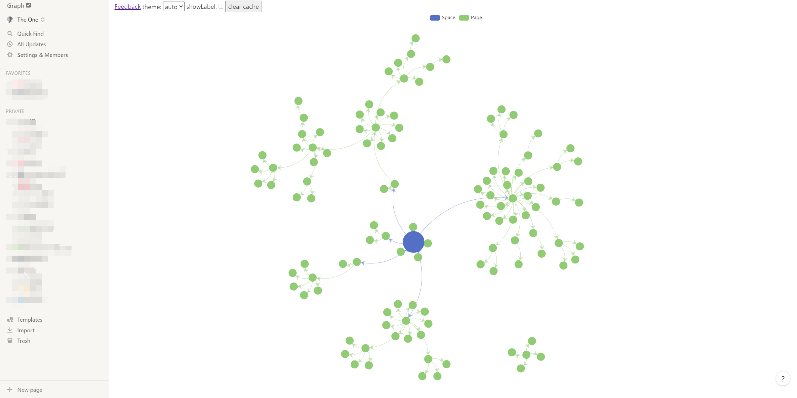

# WIP
notion published it's own API. I'm refactoring this project using [notion official API](https://developers.notion.com/).

# Introduction

no-graph lets you see the connections between pages by Relationship Chart

no-graph 让你可以通过关系图的方式来查看页面之间的联系

# Security

no-graph 没有使用第三方的 API 代理，而是通过在 Notion 页面内注入 JS 后，直接请求官方的 API 地址，你的数据只会经过官方服务器和本地存储，不会经手第三方。

Instead of using third-party API proxies, no-graph requests the official API address directly by injecting JS inside the Notion page, so your data only goes through the official servers and local storage, not through third parties.

# TODO

- [x] pages
- [ ] database
- [ ] backlinks

# Usage

1. Install tampermonkey
    - [edge](https://microsoftedge.microsoft.com/addons/detail/tampermonkey/iikmkjmpaadaobahmlepeloendndfphd)
    - [chrome](https://chrome.google.com/webstore/detail/tampermonkey/dhdgffkkebhmkfjojejmpbldmpobfkfo?hl=zh-CN)

~2. [Install script using greasyfork(deprecated)](https://twitter.com/iheyunfei/status/1457892651114455045)~

2. Install script locally
  -  click `add new script` in tampermonkey extension
  -  copy-paste [these codes](https://github.com/iheyunfei/no-graph/blob/main/bundle.js)
3. Open notion
4. Click the checkbox in the upper left corner to turn on no-graph
